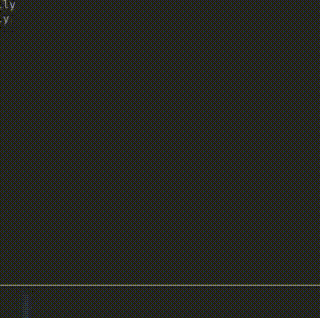

# dsa-queue-simulator
A data structure and algorithms project implementing a queue-based traffic management system for a four-way intersection with priority lanes and free-turning lanes.

---
The directory structure looks like this:
```    .
    ├── bin
    ├── build
    ├── CMakeLists.txt
    ├── generator
    │   ├── CMakeLists.txt
    │   ├── include
    │   │   └── server.h
    │   └── src
    │       ├── server.c
    │       └── traffic_generator.c
    ├── README.md
    └── simulator
        ├── CMakeLists.txt
        ├── include
        │   ├── client.h
        │   └── renderer.h
        └── src
            ├── client.c
            ├── renderer.c
            └── simulator.c
```

### How to run the project?

- Clone the project
- Make sure you have installed the required dependencies
    ```
    # For Debian based system
    sudo apt install build-essential cmake libsdl2-dev
    ```
- Make a build folder in the project repo
    ```
    mkdir build
    ```
- Change directory to `build` and run the following command:
    ```
    cd build
    cmake ..
    make
    ``` 
- The output programs will be in `bin/` directory. So,
    ```
    cd ../bin/
    ```
- And run Generator program first as it acts as a server. Then run Simulator program.
    ```
    ./Generator
    ./Simulator
    ```
### Demo

